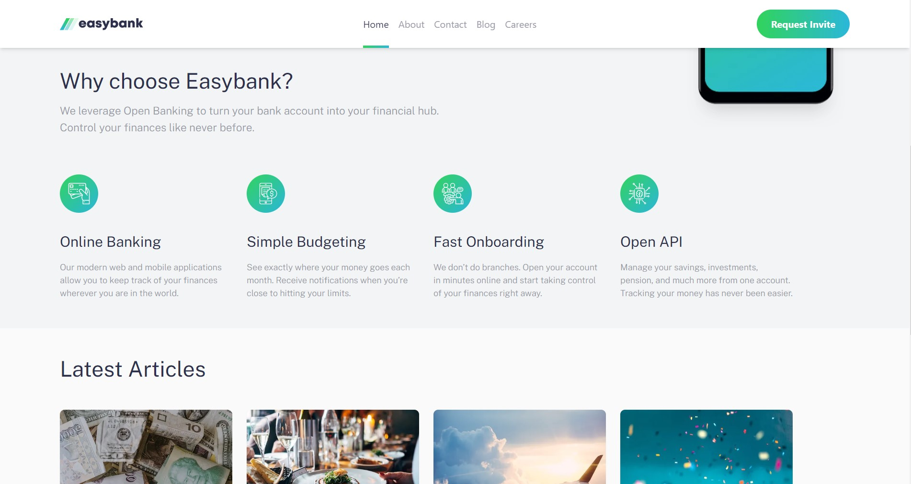

# Frontend Mentor - Easybank landing page solution

This is a solution to the [Easybank landing page challenge on Frontend Mentor](https://www.frontendmentor.io/challenges/easybank-landing-page-WaUhkoDN). Frontend Mentor challenges help you improve your coding skills by building realistic projects. 

## Table of contents

- [Overview](#overview)
  - [The challenge](#the-challenge)
  - [Screenshot](#screenshot)
  - [Links](#links)
- [My process](#my-process)
  - [Built with](#built-with)
- [Author](#author)

## Overview
Company Landing Page made using Next.js and Tailwind CSS,  it is adjusted for both desktop and mobile screens.

### The challenge

Users should be able to:

- View the optimal layout for the site depending on their device's screen size
- See hover states for all interactive elements on the page

### Screenshot

### Links

- [Solution URL](https://www.frontendmentor.io/solutions/easybank-landing-page-using-next-and-tailwind-WyzRq-rltj)
- [Live Site URL](https://easybank-landing-page-ervin-sungkono.vercel.app/)

## My process
I started the process by analyzing the design, comparing how it looks like on desktop and mobile and then figuring out how the transition from desktop to mobile would look like.

After the analyzing process, I started by breaking down the page into smaller components. Then, I developed components for each section, starting from the navigation bar and all the way down to the footer.

### Built with

- [Next.js](https://nextjs.org/) - React framework
- [Tailwind CSS](https://tailwindcss.com/) - For styles

## Author

- Website - [Ervin Cahyadinata Sungkono](https://ervin-sungkono.vercel.app)
- Frontend Mentor - [@ervin-sungkono](https://www.frontendmentor.io/profile/ervin-sungkono)
- LinkedIn - [ervin-cahyadinata-sungkono](https://www.linkedin.com/in/ervin-cahyadinata-sungkono)
