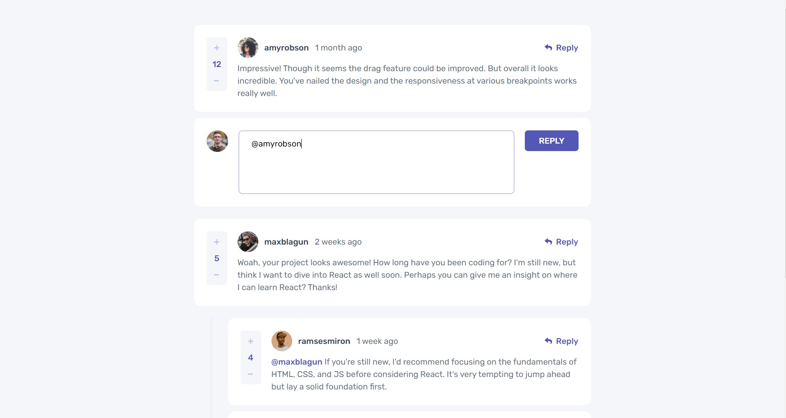
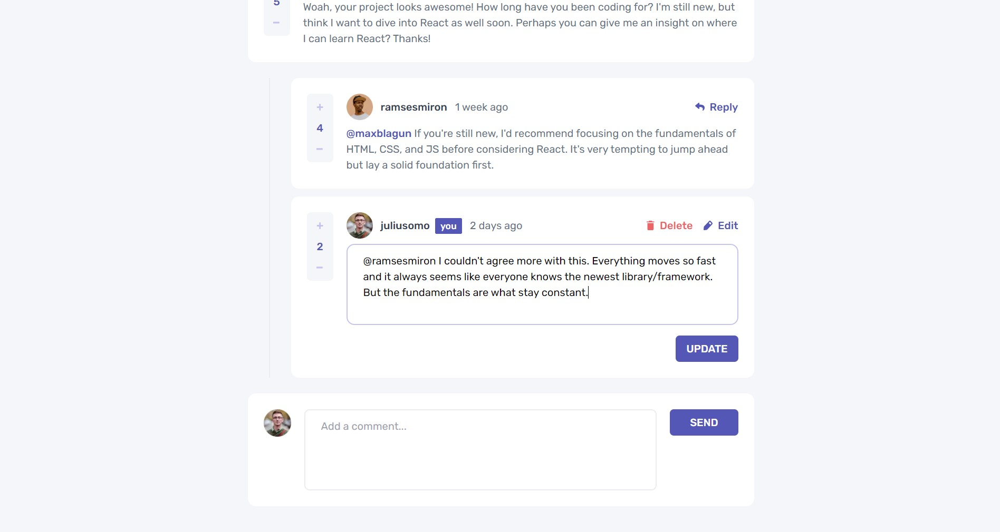
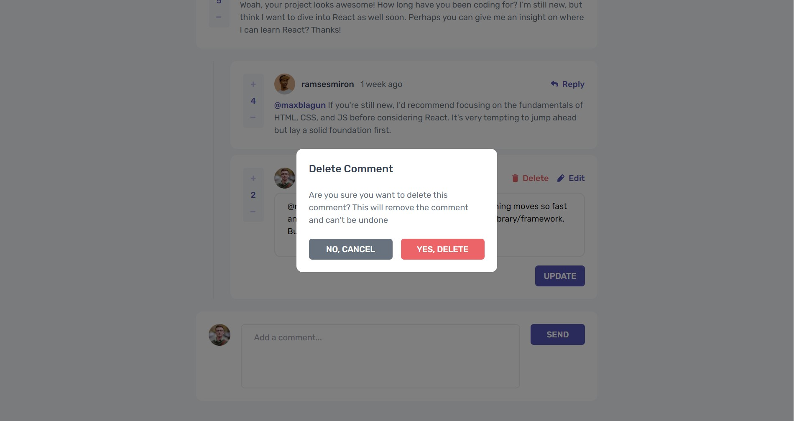

# Frontend Mentor - Interactive comments section solution

This is a solution to the [Interactive comments section challenge on Frontend Mentor](https://www.frontendmentor.io/challenges/interactive-comments-section-iG1RugEG9). Frontend Mentor challenges help you improve your coding skills by building realistic projects. 

## Table of contents

- [Overview](#overview)
  - [The challenge](#the-challenge)
  - [Screenshot](#screenshot)
  - [Links](#links)
- [My process](#my-process)
  - [Built with](#built-with)
- [Author](#author)

## Overview
Interactive Comment Section component built using Next and Tailwind. Users can add, view, update, and delete their comments, existing comments are stored in the localStorage.

### The challenge

Users should be able to:

- View the optimal layout for the app depending on their device's screen size
- See hover states for all interactive elements on the page
- Create, Read, Update, and Delete comments and replies
- Upvote and downvote comments
- **Bonus**: If you're building a purely front-end project, use `localStorage` to save the current state in the browser that persists when the browser is refreshed.
- ~~**Bonus**: Instead of using the `createdAt` strings from the `data.json` file, try using timestamps and dynamically track the time since the comment or reply was posted.~~

### Screenshot

### Links

- [Solution URL](https://www.frontendmentor.io/solutions/interactive-comments-section-component-using-next-and-tailwind-AlQKumR7wg)
- [Live Site URL](https://interactive-comments-section-ervin-sungkono.vercel.app/)

## My process
I started by breaking down the task into smaller components which is the comment section where all the comments related components are placed, input component for adding comments, comment box for existing comments, and the popup modal for delete confirmation.

After breaking down into components, I started developing from the outermost component first which is the comment section, then I developed the comment box and input. Lastly, I made CRUD actions for the comments by implementing them in the buttons.

### Built with

- Next.js
- Tailwind CSS

## Author

- Website - [Ervin Cahyadinata Sungkono](https://ervin-sungkono.vercel.app)
- Frontend Mentor - [@ervin-sungkono](https://www.frontendmentor.io/profile/ervin-sungkono)
- LinkedIn - [ervin-cahyadinata-sungkono](https://www.linkedin.com/in/ervin-cahyadinata-sungkono)
