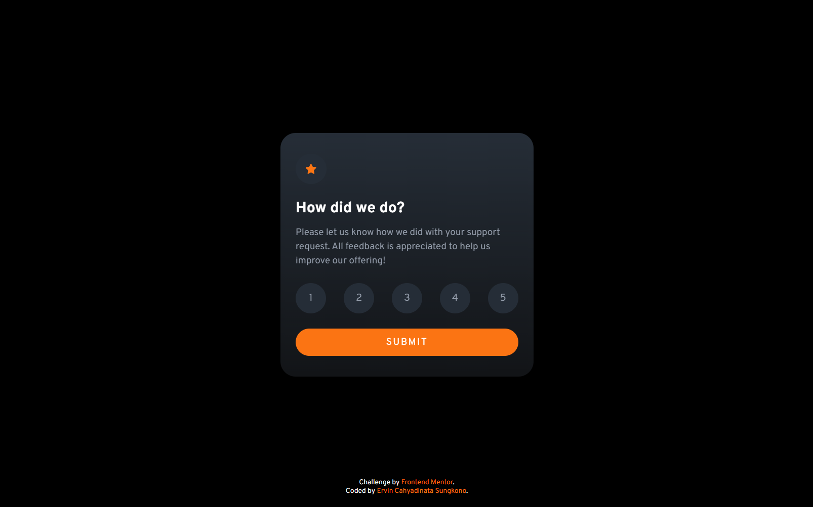

# Frontend Mentor - Interactive rating component solution

This is a solution to the [Interactive rating component challenge on Frontend Mentor](https://www.frontendmentor.io/challenges/interactive-rating-component-koxpeBUmI). Frontend Mentor challenges help you improve your coding skills by building realistic projects. 

## Table of contents

- [Overview](#overview)
  - [The challenge](#the-challenge)
  - [Screenshot](#screenshot)
  - [Links](#links)
- [My process](#my-process)
  - [Built with](#built-with)
  - [Useful resources](#useful-resources)
- [Author](#author)

## Overview
Interactive rating component card, with flip animations when submitting the rating. 

### The challenge

Users should be able to:

- View the optimal layout for the app depending on their device's screen size
- See hover states for all interactive elements on the page
- Select and submit a number rating
- See the "Thank you" card state after submitting a rating

### Screenshot

### Links

- [Solution URL](https://your-solution-url.com)
- [Live site URL](https://your-live-site-url.com)

## My process
1. Creating the HTML structure for the component
2. Importing fonts in the CSS file
3. Creating CSS variables to store color values
4. Styling the component and adding animations
5. Adding JavaScript for submit validation

### Built with

- HTML
- Flexbox
- CSS Animations

### Useful resources

- [How to create a flip card CSS by W3Schools](https://www.w3schools.com/howto/howto_css_flip_card.asp) - This helped me for adding the flip animations for the component

## Author

- Website - [Ervin Cahyadinata Sungkono](https://ervin-sungkono.vercel.app)
- Frontend Mentor - [@ervin-sungkono](https://www.frontendmentor.io/profile/ervin-sungkono)
- LinkedIn - [ervin-cahyadinata-sungkono](https://www.linkedin.com/in/ervin-cahyadinata-sungkono)
