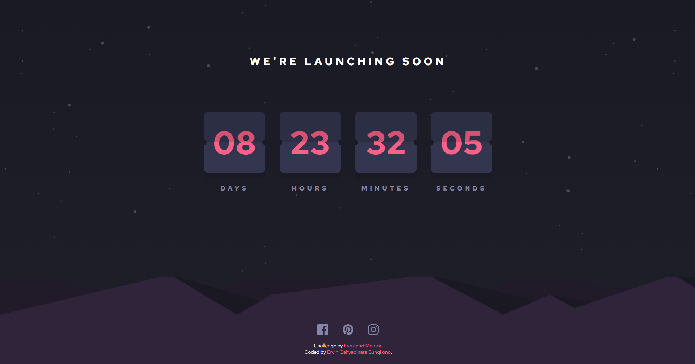

# Frontend Mentor - Launch countdown timer solution

This is a solution to the [Launch countdown timer challenge on Frontend Mentor](https://www.frontendmentor.io/challenges/launch-countdown-timer-N0XkGfyz-). Frontend Mentor challenges help you improve your coding skills by building realistic projects. 

## Table of contents

- [Overview](#overview)
  - [The challenge](#the-challenge)
  - [Screenshot](#screenshot)
  - [Links](#links)
- [My process](#my-process)
  - [Built with](#built-with)
- [Author](#author)
- [Acknowledgments](#acknowledgments)

## Overview
Countdown timer single page, the timer will start from a fixed amount of time and then keep going down until it reaches 0. Evey time a number displaed is changing, the card will show a flip animation similar to a calendar being flipped.

### The challenge

Users should be able to:

- See hover states for all interactive elements on the page
- See a live countdown timer that ticks down every second (start the count at 14 days)
- **Bonus**: When a number changes, make the card flip from the middle

### Screenshot

### Links

- [Solution URL](https://www.frontendmentor.io/solutions/launch-countdown-timer-solution-Fcrok1yzJF)
- [Live Site URL](https://ervin-sungkono.github.io/FrontendMentor.io/launch-countdown-timer-main/index.html)

## My process
1. Creating the HTML structure for the page
2. Importing fonts in the CSS file
3. Creating CSS variables to store color values
4. Styling the HTML using CSS
5. Adding JavaScript for countdown logic and animating the transitions

### Built with

- HTML
- CSS
- JavaScript

### Useful resources

- [Example resource 1](https://www.example.com) - This helped me for XYZ reason. I really liked this pattern and will use it going forward.
- [Example resource 2](https://www.example.com) - This is an amazing article which helped me finally understand XYZ. I'd recommend it to anyone still learning this concept.

**Note: Delete this note and replace the list above with resources that helped you during the challenge. These could come in handy for anyone viewing your solution or for yourself when you look back on this project in the future.**

## Author

- Website - [Ervin Cahyadinata Sungkono](https://ervin-sungkono.vercel.app)
- Frontend Mentor - [@ervin-sungkono](https://www.frontendmentor.io/profile/ervin-sungkono)
- LinkedIn - [ervin-cahyadinata-sungkono](https://www.linkedin.com/in/ervin-cahyadinata-sungkono)

## Acknowledgments

- [Countdown Flip Animation](https://codepen.io/doriancami/pen/jEJvaV) by Dorian Camillieri
